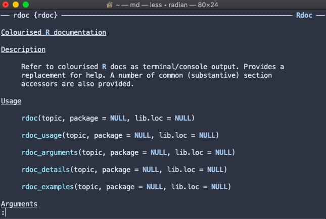
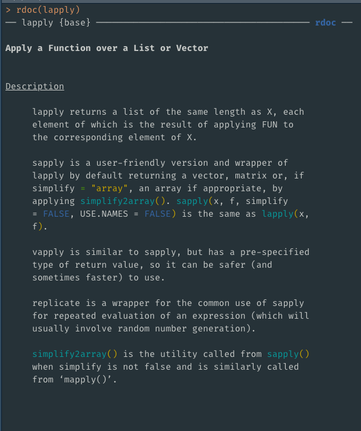

# rdoc
[](https://travis-ci.org/mdequeljoe/rdoc)
[](https://cran.r-project.org/package=rdoc)
[](https://codecov.io/gh/mdequeljoe/rdoc)
[](https://www.tidyverse.org/lifecycle/#maturing)

rdoc = `help` + `tools::Rd2txt` + [cli](https://github.com/r-lib/cli) + [crayon](https://github.com/r-lib/crayon) + [prettycode](https://github.com/r-lib/prettycode)




`rdoc` can also be used in console sessions whereby the output will be interactively printed by section to avoid flooding it with too much text. The `<enter>` keypress will
print the next section and any other keypress will exit the interaction without printing
the remaining sections. This can be disabled via `options` (see below).



## install

```r
devtools::install_github("mdequeljoe/rdoc")
```
## options

Customising `rdoc` output is possible via `options`:

```r
# text formats - defaults to rdoc_text_formats()
options(rdoc.text_formats = rdoc::rdoc_text_formats(pkg = crayon::cyan))

# doc style - defaults to rdoc_style()
options(rdoc.style = rdoc::rdoc_style(arguments = function(x) paste0("@", x)))

# item bullet style to pass to tools::Rd2txt
options(rdoc.item_bullet = ">> ")

#whether to include a package header, defaults to TRUE
options(rdoc.header = FALSE)

#whether output be split by sections for non-terminal usage, defaults to TRUE
options(rdoc.by_section = FALSE)

```

## base replacements

`help` and `?` can be overridden via:

```r
rdoc::use_rdoc()
```

Resetting is possible with:

```r
rdoc::rm_rdoc()
```

## contributing

contributions/suggestions welcome!

