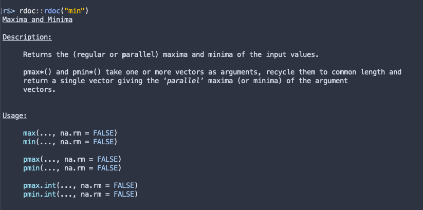

# rdoc
[](https://travis-ci.org/mdequeljoe/rdoc)
[](https://cran.r-project.org/package=rdoc)
[](https://www.tidyverse.org/lifecycle/#maturing)

rdoc = `?` + `tools::Rd2txt` + [cli](https://github.com/r-lib/cli) + [crayon](https://github.com/r-lib/crayon) + [prettycode](https://github.com/r-lib/prettycode)



## install

(work in progress)
```r
devtools::install_github("mdequeljoe/rdoc")
```
